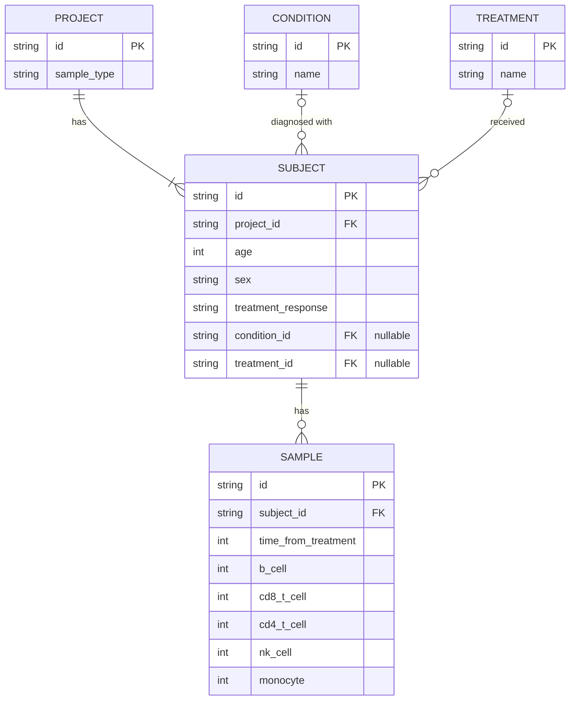

# Entity-Relationship Diagram

## Cardinalities

- **Project ↔ Subject**: 1 project → 1..* subjects; each subject → exactly 1 project.
- **Condition ↔ Subject**: 1 condition → 0..* subjects; each subject → 0..1 condition (nullable FK on Subject).
- **Treatment ↔ Subject**: 1 treatment → 0..* subjects; each subject → 0..1 treatment (nullable FK on Subject).
- **Subject ↔ Sample**: 1 subject → 0..* samples; each sample → exactly 1 subject.

## Notes

- `sample_type` lives on Project, not Sample: in the source CSV it is fully determined by project (each project uses exactly one sample_type across all its samples), and PBMC vs. WB is a lab-processing/protocol choice that's realistically standardized per study site rather than varying per subject or per draw. Storing it on Sample would be a transitive functional dependency (Sample → Subject → Project → sample_type).
- No direct Condition↔Treatment relationship: the CSV shows a full cross-product of the two active treatments against the two non-healthy conditions, with no combination missing — consistent with treatment being assigned independently of condition, not with condition constraining eligible treatments. More importantly, any condition-treatment pairing is already derivable by joining through Subject's own `condition_id`/`treatment_id` FKs; a dedicated `condition_treatment` junction table would just duplicate that with no independent source of truth behind it.
